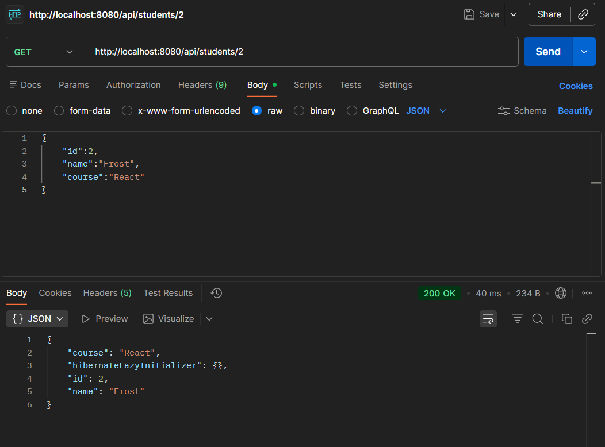
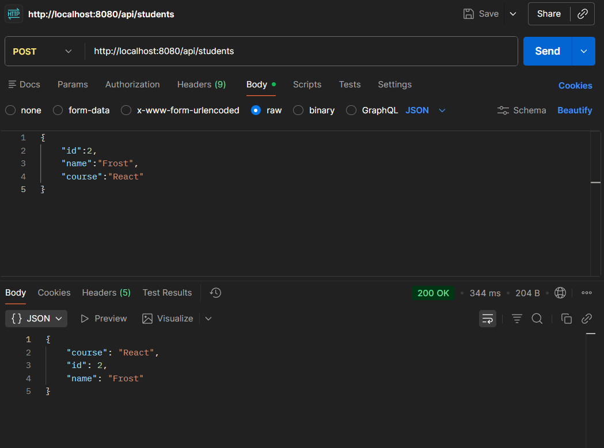
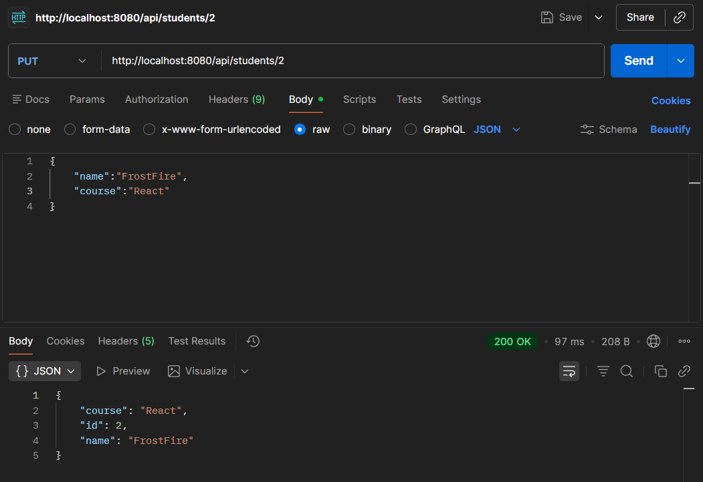
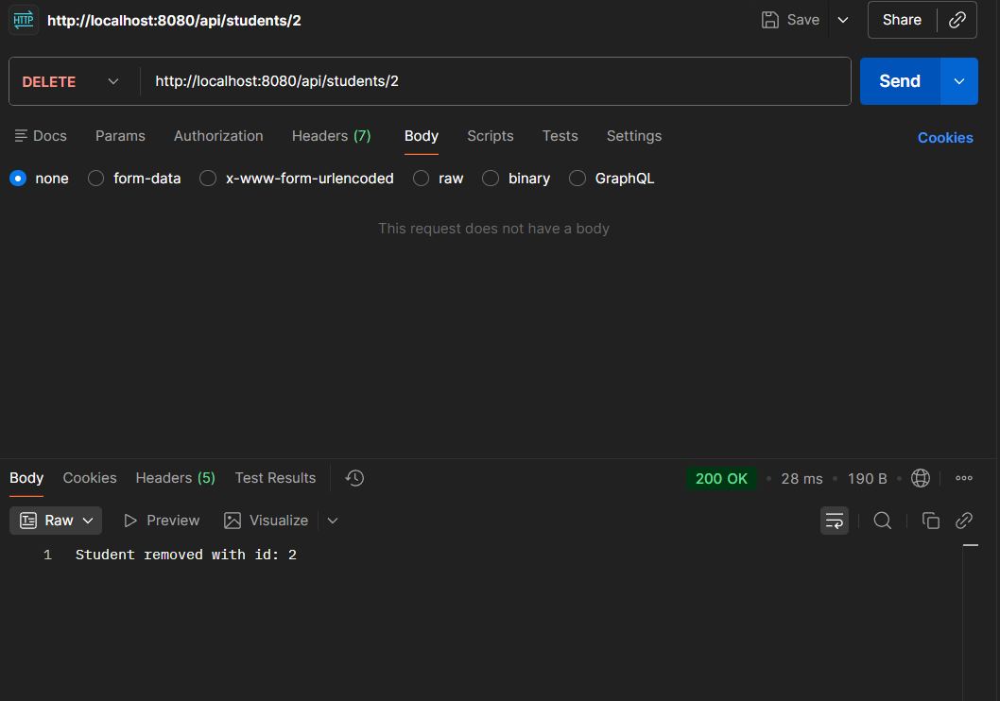

# Experiment 8: REST API Development

## Overview
This experiment demonstrates the development of a RESTful API using Spring Boot. The API provides endpoints to manage student records, including retrieving all students, fetching a student by ID, and adding new students. The application uses Spring Data JPA for database interactions and MySQL as the underlying database.

## Technologies Used
- **Java**: Version 21
- **Spring Boot**: Version 4.0.3
- **Spring Data JPA**: For ORM and database operations
- **Spring Web MVC**: For building REST endpoints
- **MySQL**: Database for storing student data
- **Maven**: Build tool and dependency management

## Prerequisites
- Java 21 or higher installed
- MySQL server running on localhost:3306
- Maven installed for building the project

## Project Structure
- `src/main/java/com/AML2A/Rest_API/RestApiApplication.java`: Main Spring Boot application class
- `controller/StudentController.java`: REST controller handling HTTP requests
- `service/StudentService.java`: Service layer containing business logic
- `repository/StudentRepository.java`: JPA repository for data access
- `model/Student.java`: Entity class representing the Student model
- `src/main/resources/application.properties`: Configuration file for database and JPA settings


## Database Setup
1. Create a MySQL database named `chandigarh_university`.
2. Update the database credentials in `src/main/resources/application.properties` if necessary:
   ```
   spring.datasource.username=root
   spring.datasource.password=70321
   ```
   Note: Change the password to match your MySQL setup.

## How to Run
1. Clone or navigate to the project directory.
2. Ensure MySQL is running and the database is set up as described above.
3. Build the project using Maven:
   ```
   mvn clean install
   ```
4. Run the application:
   ```
   mvn spring-boot:run
   ```
   The application will start on port 8080 by default.

## API Endpoints
- **GET /api/students**: Retrieve all students
  - Response: List of Student objects in JSON format
- **GET /api/students/{id}**: Retrieve a student by ID
  - Path Parameter: `id` (integer)
  - Response: Student object in JSON format
- **POST /api/students**: Add a new student
  - Request Body: JSON object with `id`, `name`, and `course` fields
  - Response: Created Student object in JSON format
- **PUT /api/students/{id}**: Update an existing student
  - Path Parameter: `id` (integer)
  - Request Body: JSON object with updated `name` and `course` fields
  - Response: Updated Student object in JSON format
- **DELETE /api/students/{id}**: Delete a student by ID
  - Path Parameter: `id` (integer)
  - Response: Confirmation message

## Screenshots

### GET Request

*Screenshot showing the GET request to retrieve all students.*

### POST Request

*Screenshot showing the POST request to add a new student.*

### PUT Request

*Screenshot showing the PUT request to update a student.*

### DELETE Request

*Screenshot showing the DELETE request to remove a student.*

## Student Model
```json
{
  "id": 1,
  "name": "John Doe",
  "course": "Computer Science"
}
```

## Learning Outcomes
In this experiment, we learned:
- How to set up a Spring Boot project with Maven
- Implementing RESTful endpoints using Spring Web MVC
- Using Spring Data JPA for database operations
- Configuring MySQL database connection
- Structuring a layered architecture (Controller, Service, Repository)
- Handling HTTP requests and responses in JSON format

## Notes
- The application uses Hibernate DDL auto-update, so tables are created automatically.
- SQL queries are logged to the console for debugging purposes.
- This is a basic implementation; in a production environment, consider adding validation, error handling, and security features.
